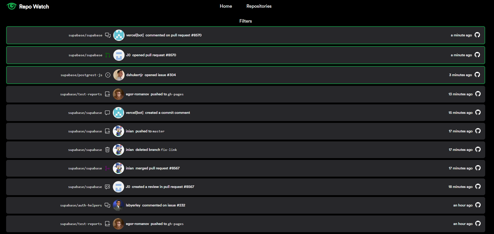

</img>

<h1 align="center">Repo Watch</h1>

Watch for changes to Supabase repositories in real time

</img>

Made as part of <a href="https://supabase.com/blog/launch-week-5-hackathon">Supabase Launch Week 5 Hackathon</a>

Built With

</img>
</img>

---

# Features

- Real time\* updates for github events (PRs, issues, comments, pushes)
- Filter according to username, repository, event type
- Direct links to corresponding github pages
- Universal view (all repos) & per-repo view

\*within the minute

# How it Works

This project makes heavy use of [Supabase](https://supabase.com/) features:

- Cron job [hosted on supabase](https://supabase.com/blog/postgres-as-a-cron-server) triggers an edge function every minute
- [Edge function](https://supabase.com/docs/guides/functions) polls the GitHub API for events, processes them and stores them in database (hosted by Supabase, of course!)
- Changes to the database are broadcasted to the frontend via [Supabase Realtime](https://supabase.com/docs/guides/realtime)

# Future Plans

- Webhook based fork & setup tools to support more repositories (see [#3](https://github.com/vvidday/repo-watch/issues/3))
- More information for repositories (e.g. number of stars today)
- Better body/summary information

# Acknowledgements

Icons from [Octicons](https://primer.style/octicons/)

Font from [Supabase](https://github.com/supabase/supabase/tree/master/web/static/fonts/custom)
